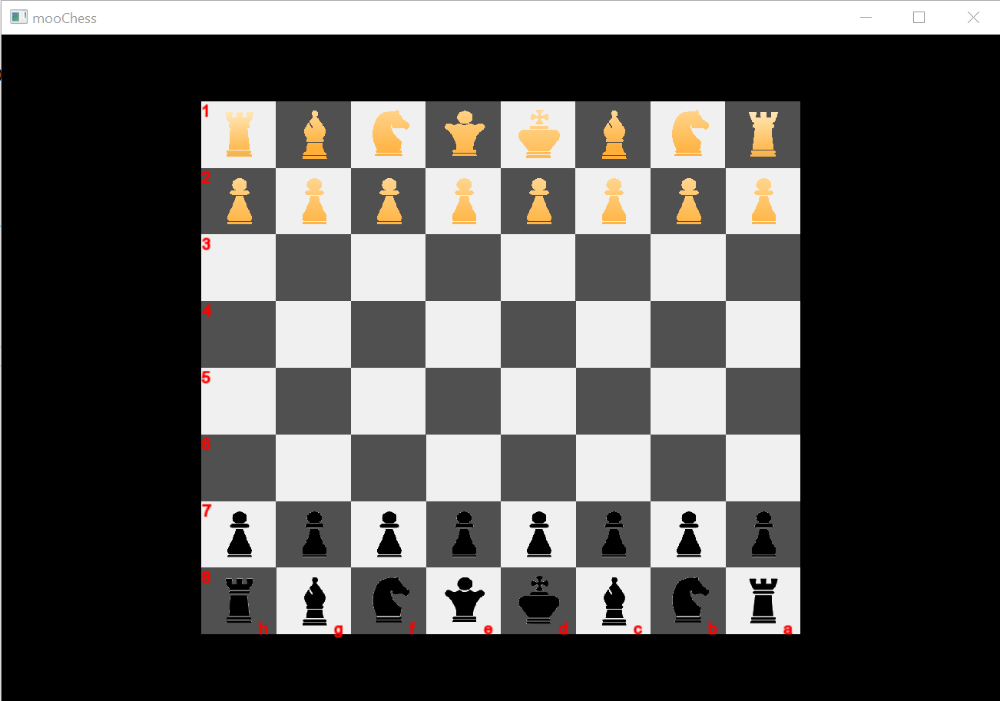

# Client-server chess

## Requirements

* Client: [SFML](https://www.sfml-dev.org/)
* Server: any webserver supporting PHP, MySQL

## Building

Builds require [XMake](https://xmake.io/) and [vcpkg](https://vcpkg.io/).

xmake might require environment variable, `VCPKG_ROOT` defined and pointing to the vcpkg installation directory.
vcpkg coming with Visual Studio is manifest-mode-only, so it might not be suitable.

To build client, run `xmake` in the project root.

## Configuration

For client, config file is `game.cfg` and consists of these lines, in this order:

1. `data path` - the path to the resources directory, default: `./data`
2. `server host` - base URL to the server, default: 'localhost'
3. `find side url` - relative URL on the server to look up for the opponent, when game was started in `random` mode; default is `index.php?find_side`
4. `find opponent url` - relative URL on the server to look up for the opponent, when game was started in a determined (`white` or `black`) mode; default - `index.php?find_opponent`
5. `server move validation url` - relative URL on the server to validate the player's move; default - `index.php?validate_move`
6. `server querying url` - relative URL on the server to check for the moves pending; default value is `index.php?update_client`
7. `game start test url` - relative URL on the server to check whether game was started; default - `index.php?is_game_started`

For server, all the configuration is put inside the main file itself and consists only of database configuration. The options are:

1. `DB_NAME`
2. `DB_HOST`
3. `DB_USER`
4. `DB_PASSWORD`

**Be sure to review them before running the server.**

Then you will need to create database structure - you can easily achieve this by importing `db_setup.sql` file from the server directory to the database described by those constants above.

## Running

To run client, run it with the side you want to play as (`white`, `black` or `random`): `xmake run client random`.

To run server, use the `server.php` file.
