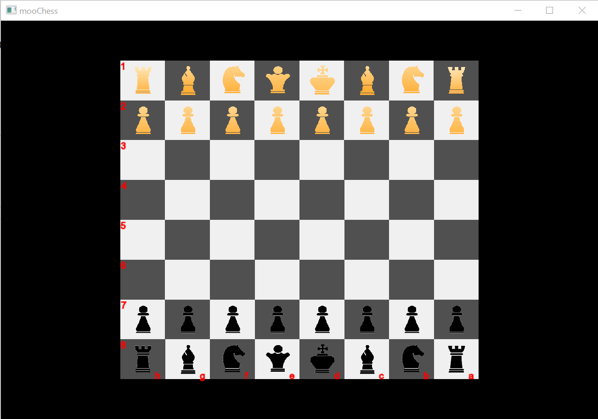

# Client-server chess



The game uses a few 3rd party libraries:

* [SDL2](https://github.com/libsdl-org/SDL)
* [SDL_image](https://github.com/libsdl-org/SDL_image)
* [imgui](https://github.com/ocornut/imgui)

## Building

Builds require [XMake](https://xmake.io/) and [vcpkg](https://vcpkg.io/).

xmake might require environment variable, `VCPKG_ROOT` defined and pointing to the vcpkg installation directory.
vcpkg coming with Visual Studio is manifest-mode-only, so it might not be suitable.

To build client, run `xmake` in the project root.

## Running

To run client, run it with `xmake run client`.

## XMake VSCode integration

XMake has a nice [integration with VSCode](https://github.com/xmake-io/xmake-vscode?tab=readme-ov-file#intellisense), but requires one manual step to fully support IntelliSense: add a `.vscode/c_cpp_properties.json` file with the following content:

```json
{
    "configurations": [
        {
            "name": "default",
            "compileCommands": ".vscode/compile_commands.json"
        }
    ],
    "version": 4
}
```
