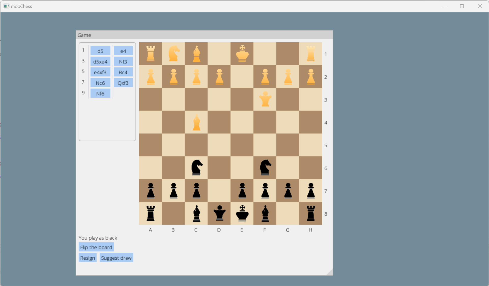

# Client-server chess

The game uses a few 3rd party libraries:

* [SDL2](https://github.com/libsdl-org/SDL)
* [SDL_image](https://github.com/libsdl-org/SDL_image)
* [imgui](https://github.com/ocornut/imgui)
* [tinyxml2](https://github.com/leethomason/tinyxml2)

## Building

Builds require [XMake](https://xmake.io/) and [vcpkg](https://vcpkg.io/).

xmake might require environment variable, `VCPKG_ROOT` defined and pointing to the vcpkg installation directory.
vcpkg coming with Visual Studio is manifest-mode-only, so it might not be suitable.

To build client, run `xmake` in the project root.

## Running

To run client, run it with `xmake run client`.
